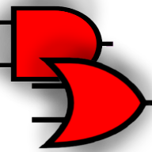

# 
 Circuity

  <b>Build, test, and play with digital circuits in the browser.</b>

  <a href="https://circuity.vercel.app">Live App</a>
  ·
  <a href="#todo">Roadmap</a>

	
	
 	
	
 

	
[//]: # (	)

[//]: # (	)

A little project I'm working on... I'm too lazy to write the readme at the moment, so just try it out (https://circuity.vercel.app or https://circuity.deltos.space for production) :) Readme coming soon...

---

## TODO:

done items are removed

**IMPORTANT (in order):**

- [ ] Add ctrl+z
- [ ] Add component inspection pa
- [ ] Sort elements in the design by ViewOrder (last selected desc)

  **OTHER:**

- [ ] hackatime backend badge doesnt work on github
- [ ] components: flip-flops, multiplexers, decoders, signal emitters/receivers
- [ ] Do something with the {-1, -1}, {-1, -1}, {.. pin initialization!
- [ ] Make the buzzer look better
- [ ] Add revert button (to default setting) in component properties like in davinci resolve
- [ ] Components right after spawn (by dragging or dropping) have huge decimal points (arent rounded up)
- [ ] Make the components actually snap TO THE GRID
- [ ] Add tutorials (~~general~~ + for each component)
- [ ] Do we need canvas.focus every tick??/?
- [ ] Add a gradient color when simulating on wires (HI or LO): <== keep??
- [ ] Add custom context menu
- [ ] dark mode
- [ ] (??) Add separate methods for mouseOverComponent and Pin in general (not only for each component)
- [ ] Pick color for the selection indicator
- [ ] Add alignment guides and step snapping setting
- [ ] Move all constant strings to a constants file with array (=> translations possible)
- [ ] Add component categories, favourites and info panels
- [ ] Fix canvas clipping under palette (??, `background: white; z-index: 5;` + position relative)

---

Also here is the command to generate a new component in Angular on windows if you have the env variables broken that I can't remember:

`npx --package @angular/cli ng g c palette`
